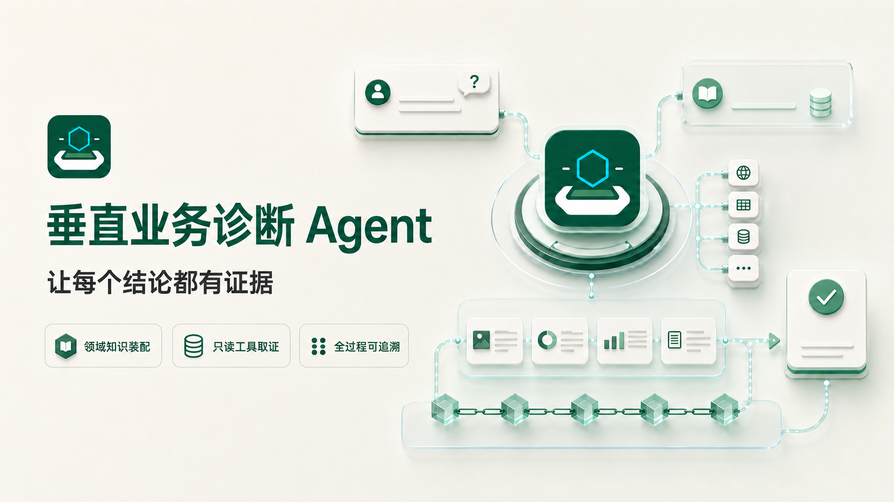
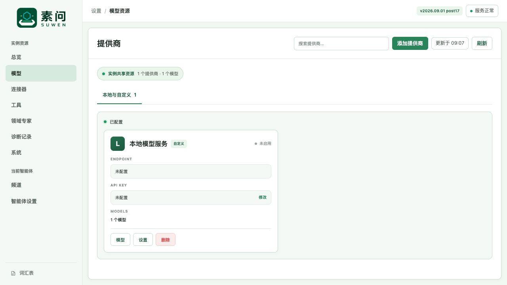

# 素问（Suwen）



> 让诊断结论带着证据回来。

素问不是通用聊天机器人，而是一款面向垂直业务场景的证据驱动诊断 Agent。它把一个领域的知识、
只读业务工具和诊断规则装配成专用 Agent，让它围绕具体问题主动调查、形成结论，并保留完整证据。

使用者可以通过飞书等频道或 HTTP API 提问；管理员通过中文管理台配置模型、连接器和智能体，
查看每次诊断使用了哪些数据、经过了哪些步骤，以及最终答复基于什么证据。

## 它和通用 Agent 有什么不同

- **领域知识装配**：每个 Agent 都可以绑定自己的领域专家、提示词和工具，不依赖一套通用回答方式。
- **只读工具取证**：Agent 不只依靠模型已有知识，还会从日志、数据库、知识库等业务系统读取现场数据。
- **全过程可追溯**：最终答复与 Evidence、工具调用和模型回合保存在同一个 Case 中，可以随时复查。
- **为诊断持续追问**：同一个问题可以在一个 Case 中继续补充信息，Agent 会沿用已有证据继续调查。
- **明确证据边界**：系统区分零结果、无法观察、查询失败和部分数据，避免把“没查到”说成“没有”。

## 产品界面



管理台提供模型、连接器、工具、领域专家、智能体、频道、诊断记录和系统状态等页面。

## 开始前需要准备

- macOS 或 Linux
- Python 3.11 或更高版本
- 一个可用的 OpenAI-compatible 模型服务地址和 API Key
- 可选：提供业务数据读取能力的 MCP Connector

## 安装并启动

在解压后的 Suwen 发行目录中执行：

```bash
shasum -a 256 -c SHA256SUMS

python3 -m venv .installer
. .installer/bin/activate
python -m pip install ./suwen_agent-*-py3-none-any.whl

suwen install --source ./suwen_agent-*-py3-none-any.whl
~/.suwen/bin/suwen provision-access-tokens
~/.suwen/bin/suwen serve --host 127.0.0.1 --port 18090
```

服务启动后，浏览器打开：

```text
http://127.0.0.1:18090
```

管理台首次登录需要 `admin_token`。它保存在本机：

```text
~/.suwen/workspace/.data/private/access-tokens.json
```

同一文件中的 `api_token` 用于调用 Case API。这个文件包含访问凭据，请勿提交到代码仓库或发送给他人。

## 完成第一次配置

登录管理台后，按下面的顺序即可让第一个 Agent 工作：

1. 打开“模型”，添加模型提供商，填写 Endpoint 和 API Key，并选择模型。
2. 如果需要读取外部数据，打开“连接器”，添加并连接只读 MCP Connector。
3. 打开“智能体设置”，创建智能体，选择模型、提示词、领域专家和可用工具。
4. 打开“频道”接入飞书，或者直接使用 HTTP API 提问。

模型或 Connector 没有通过连接验证时，智能体不会带着不完整配置开始工作；管理台会显示需要处理的配置项。

## 发起一次诊断

完成智能体配置后，可以通过已连接的频道直接提问。也可以使用 `api_token` 调用 API：

```bash
curl -sS http://127.0.0.1:18090/api/v1/cases \
  -H "Authorization: Bearer <API_TOKEN>" \
  -H "Content-Type: application/json" \
  -d '{"agent_id":"<AGENT_ID>","content":"请调查这个问题，并给出证据支持的结论。"}'
```

请求会创建一个 Case 并启动诊断。后续可以通过频道继续追问，或调用
`POST /api/v1/cases/<CASE_ID>/messages` 向同一个 Case 追加问题。

## 查看诊断结果

在管理台打开“诊断记录”，可以查看：

- 用户问题和 Agent 最终答复
- 本次诊断调用过的工具
- 每条 Evidence 的来源、状态和内容
- 模型回合与诊断过程
- 当时使用的模型、智能体和配置版本

当数据源没有返回结果、无法访问或只返回部分数据时，素问会保留对应状态，帮助你区分“没有发现”与“没有查到”。

## 数据与访问安全

- 服务默认只监听本机 `127.0.0.1`。
- Case、Evidence 和配置保存在 `~/.suwen/workspace/` 下的本地 SQLite 与数据目录中。
- 业务 Connector 默认只能提供只读工具。
- API 与管理台使用不同的访问令牌。
- 模型和 Connector 密钥只应保存在本机私有配置或环境变量中。
